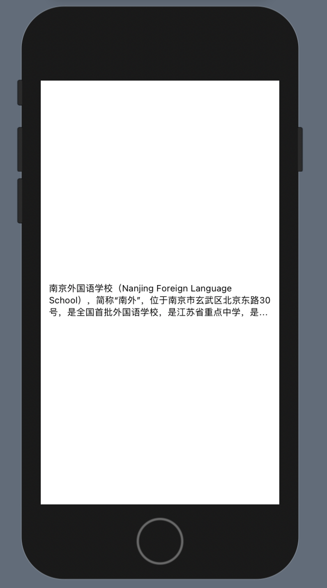
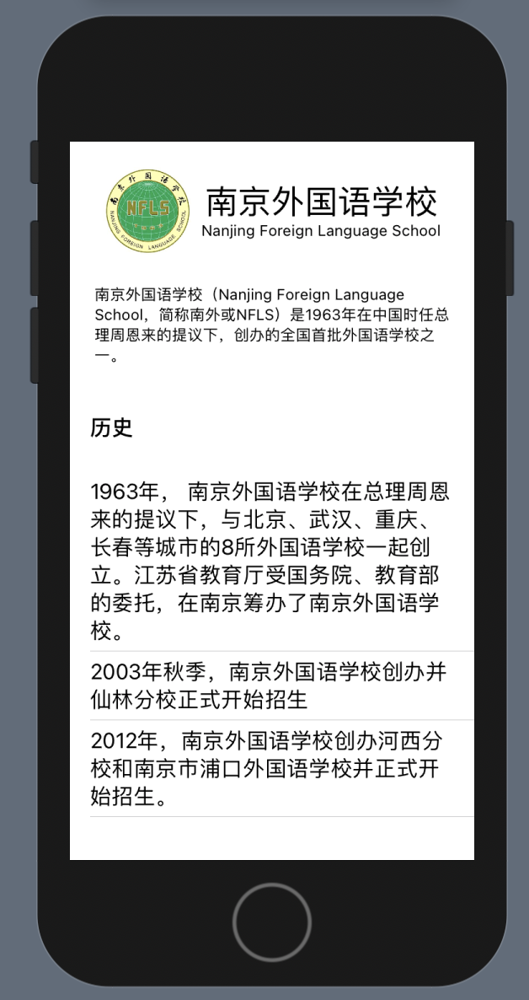
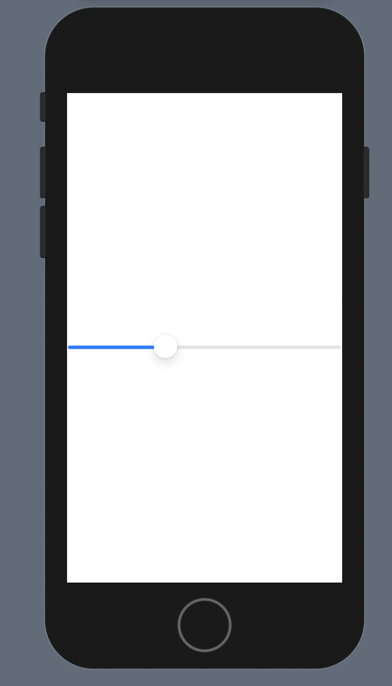
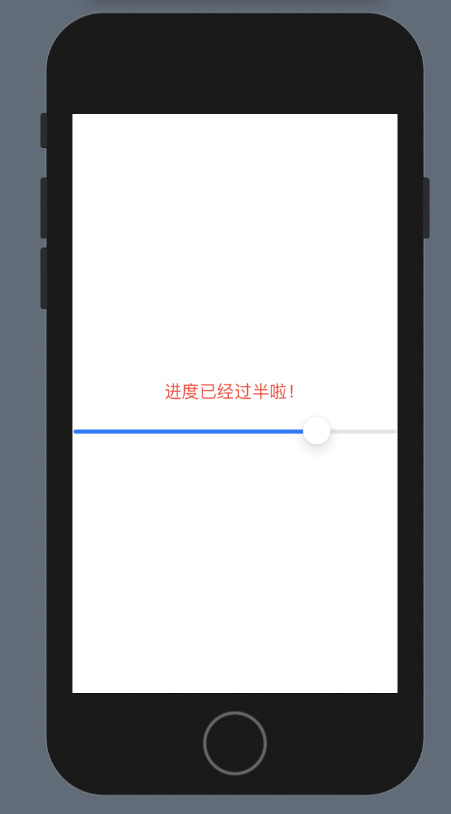
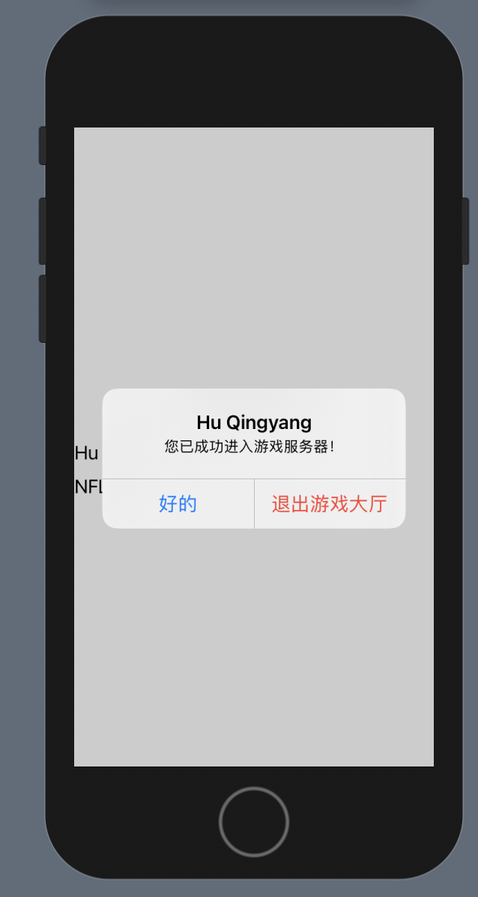

# 期中作业

**请大家在下次上课前完成作业**，预计用时1-2小时左右，具体取决于熟练程度。**下周五上课时请把作业带好，我会在上课前进行检查。**作业文件是一个Xcode项目，直接在项目内进行就该即可。

请使用 **Preview** 功能完成本次作业，不要运行模拟器。

调试代码时的几个建议：

1. 在修改代码内容时，不要忘了 `.` 、 `{}`  和 `()` 。如果出现编译错误（红叉）时，也先检查是否有遗漏这些内容。一个`{` 就要对应一个`}` ，一个`(` 就要对应一个`)` 。
2. 保持良好的缩进，这样可以避免遗漏上面提到的内容。
3. 必要时可以参考苹果的官方文档及 StackOverflow，善用搜索功能。[https://developer.apple.com/documentation/swiftui/](https://developer.apple.com/documentation/swiftui/)
[https://stackoverflow.com/](https://stackoverflow.com/)
4. 如果有问题，欢迎在群内提出，但请注意：**不要复制粘贴完整的代码，避免被他人抄袭**。

## Assignment 1 基础展示组件复习

1. 给文本左右添加留白。
2. 将文本字号修改小，
3. 只显示文本的前3行文字。

提示：一共只需要添加3行代码即可。本题目主要考察 `Text` 的基础使用方法。最终效果如右图。

## Assignment 2 `VStack` 及 `HStack` 排版复习

1. 去百度搜索上下载学校校徽，并使用 `Image` 添加至屏幕左上角，图片大小要需要适中。
2. 在校徽右侧，使用 `Text` 书写“南京外国语学校”及英文“Nanjing Foreign Language School“。英文需要在中文的下方，且字体要小一些。这两步需要嵌套 `HStack` 与 `VSatck`。
3. 将校徽和校名排在一行内。
4. 在下方，使用 `Text` 简要介绍学校内容，字体大小要比正文字体要小，具体文字为：

    > 南京外国语学校（Nanjing Foreign Language School，简称南外或NFLS）是1963年在中国时任总理周恩来的提议下，创办的全国首批外国语学校之一。

5. 在学校简介的下方，使用 `Text` 添加一个标题，名称为“历史”，字体大小要适合标题使用。
6. 在最后，使用 `Text` 以列表的方式呈现学校的历史，具体内容已经粘贴在了代码之中。

提示：本题目主要考察 `VStack` 及 `HStack` 的嵌套、`List` 的用法、以及 `Image` 添加时，需要对 `Assets.xcassets` 、 `resizable` 及 `aspectRatio` 进行的设置。

## Assignment 3 基础控制组件复习

1. 对排版自行进行修改，使其看起来美观，此步骤没有统一要求。
2. 点击按钮时，将“我的个人信息“这6个字修改为按钮所对应的内容。例如，在点击“我的学校“时，将文字修改成“南京外国语学校”。

提示：本题目主要考察 `@State` 及 `Button` 的使用方法。

## Assignment 4 条件布局

1. 创建一个 `Slider`。
2. 将文本修改成红色的 “进度已经过半啦！“
3. 在 `Slider` 过半（大于 `0.5` 时），显示“进度已经过半啦！“，其余时候隐藏。

提示：本题目主要考察 `Slider`、`@State` 及 `if`语句的使用方法。

## Assignment 5 密码弹窗

1. 添加两个文本框 TextField，输入的内容为用户名和暗号。
2. 对排版自行进行修改，使其看起来美观，此步骤没有统一要求。
3. 思考一个“暗号”，例如“NFLS”，此处没有要求。
4. 点击按钮时，判断“暗号”内输入的内容是否正确（即，跟第3步想的内容一致）。如果正确，弹出如右图所示的提示框：标题为用户之前输入的用户名，内容为“您已成功进入游戏服务器”。如果点击“好的”，不做任何修改。如果点击“退出游戏大厅”，清空“用户名”和“暗号”内的内容。如果不正确，不做任何反应。

提示：本题目主要考察 `Alert` 及 `TextField` 的用法。

